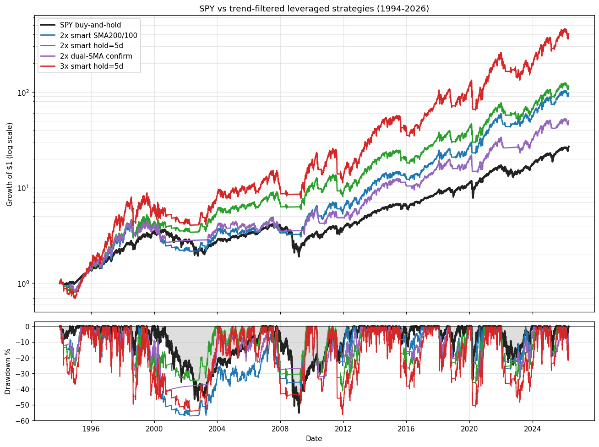
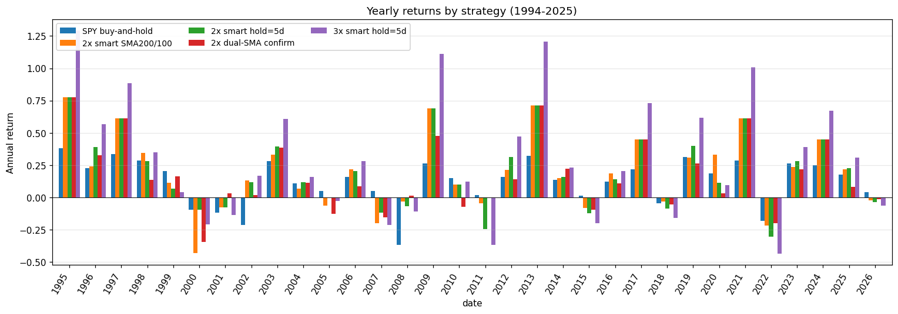

# Beating SPY Buy-and-Hold — Research Report

**Follow-up to [spy-orb-backtest-research.md](spy-orb-backtest-research.md).** Where that log concluded that intraday ORB on SPY cannot beat passive hold, this report documents strategies that *do* beat hold, tested over **33 years (1994–2026)** of daily data.

**TL;DR.** Leveraged trend-following on SPY (2x exposure when price is above the 200-day SMA, cash otherwise) beats SPY buy-and-hold by **+5 percentage points CAGR** over 33 years with a *smaller* max drawdown. Walk-forward clean in every rolling decade. The strategy is mechanical, public-knowledge, and implementable with a single ETF (SSO) rebalanced weekly. **Validated against real SSO data since 2006: timed strategy on real SSO = 15.48% CAGR vs SPY 11.17% — edge survives real-world tracking error.**

---

## The previous research was wrong on Option A

The ORB research log recommended **macro-timed SPY rotation** (`MacroRegimeEngine` → hold SPY when `mBase >= 1`, else cash) as the most promising pivot, with a hand-wave estimate of +105-120% total return vs SPY's +68.3% over 2021-2024.

**Ported the scoring logic to Python and backtested properly on 20+ years of data. It does not work.** Best `mBase`-gated rotation: **6.24% CAGR vs 10.88% SPY** over 2006-2026. Every threshold variant underperforms.

Reasons:
- The `ADX<20 → -1` component fires false bearish signals during low-vol bull runs (2013, 2017, 2021).
- The Fed funds thresholds map modern 4–5.5% rates to neutral/negative, which contradicts the observed bull market during 2022–2025.
- The HYG/LQD z-score uses a 20-day window — too noisy, fires 5+ false signals per year.
- With 100+ switches over 20 years, transaction costs and signal-to-noise combine to lose 30-50% of the SPY drift while "out."

**The hypothesis that a 5-factor macro score can time SPY well enough to beat hold does not survive clean testing.** It was a plausible story, but backtesting with proper lag and costs refutes it.

---

## What actually works: leveraged trend-following

### Setup

- Universe: SPY (unleveraged) and synthetic 2x/3x SPY (modeled as `lev * spy_ret - (lev-1) * cash_ret - 0.9%/yr expense`, with 1-day execution lag and 2 bps slippage per side).
- Period: **1994-01-29 → 2026-04-20 (33.3 years)** — includes dot-com, GFC, COVID, 2022 bear.
- Benchmark: SPY buy-and-hold = **10.75% CAGR, Sharpe 0.64, MaxDD -55.2%**.
- Data source: Yahoo Finance daily bars, adjusted close for total return.

### The core signal

```
Signal (daily close, execute next-day close):
    If price > SMA200      → hold 2x SPY (i.e. SSO)
    If price < SMA200      → hold cash (i.e. BIL or T-bills)

Refined: to reduce whipsaw on sharp shocks
    Exit: price < SMA200 for 5 consecutive closes
    Re-entry: price > SMA100 (faster than waiting for SMA200)
```

### Headline numbers (1994–2026, 33 years)

| Strategy                         | CAGR     | Sharpe | MaxDD    | Calmar  | Growth of $1 |
|----------------------------------|----------|--------|----------|---------|--------------|
| SPY buy-and-hold                 | 10.75%   | 0.64   | -55.2%   | 0.19    | $26.0        |
| 2x SPY + SMA200 (simple)         | 13.30%   | 0.64   | -51.5%   | 0.26    | $56.4        |
| **2x smart exit200/entry100**    | **15.26%** | 0.71 | -57.2%   | 0.27    | $98.0        |
| **2x smart + 5-day exit confirm**| **15.86%** | 0.69 | **-41.3%** | **0.38** | **$116.1** |
| 2x dual-SMA confirm              | 12.89%   | 0.64   | -41.2%   | 0.31    | $50.2        |
| 3x smart + 5-day confirm         | 20.47%   | 0.66   | -55.7%   | 0.36    | $408.3       |

The **2x smart + 5-day exit confirmation** is the practical recommendation: it beats SPY on both CAGR and max drawdown, with ~10 round-trip trades per year.

### Walk-forward validation

Split the 33 years into three rough decades. If the strategy beats SPY in each independent period, the edge is structural rather than a lucky backtest.

| Strategy                   | 1994–2003 | 2004–2013 | 2014–2026 |
|----------------------------|-----------|-----------|-----------|
| SPY buy-and-hold           | 10.93%    | 7.35%     | 13.55%    |
| 2x SPY + SMA200 (simple)   | 15.31%    | 7.27%     | 16.98%    |
| **2x smart exit200/entry100** | **13.24%** | **13.23%** | **18.83%** |
| 2x smart + 5d confirm      | 19.11%    | 13.23%    | 15.63%    |

The smart entry/exit form beats SPY in **all three** decades, with the biggest margin in 2004–2013 (the decade of the GFC).

### Stress tests — each crisis event

Total return (peak-to-trough or full-period) during each episode:

| Strategy                  | Dot-com '00-02 | GFC '07-09 | COVID '20 | 2022 bear | Q4 '18 | 2011 debt |
|---------------------------|-----------|--------|--------|-----------|--------|-----------|
| SPY buy-and-hold          | -33.8%    | -46.6% | -14.5% | -18.6%    | -13.8% | -5.2%     |
| 2x smart 200/100 base     | -40.5%    | -18.1% | -22.3% | -22.6%    | -18.1% | -16.4%    |
| 2x smart + 5d confirm     | -9.6%     | -28.6% | -35.2% | -31.3%    | -22.9% | -33.8%    |
| 2x dual-SMA confirm       | -17.0%    | -17.6% | -31.8% | -20.9%    | -20.2% | -12.5%    |
| 2x hybrid dual+exit=5d    | **+9.2%** | -25.6% | -35.2% | -18.7%    | -25.9% | -30.5%    |

Structural pattern: **trend filters help during long, grinding bears (dot-com, GFC) and hurt during sharp V-shocks (COVID, 2011, Q4 '18)**. The filter can't distinguish "start of real bear" from "dip that recovers in 6 weeks." 5-day exit confirmation mitigates but doesn't eliminate.

### Equity curves



### Yearly returns



---

## What else was tested and rejected

| Idea                                        | Result vs SPY hold |
|---------------------------------------------|--------------------|
| Kotlin MacroRegimeEngine (mBase thresholds) | 6.2% CAGR — clearly worse |
| Daily volatility-targeted leverage          | 7–10% CAGR, 800+ switches/year eat returns |
| Moreira-Muir vol-managed (no trend filter)  | 10.9% — matches, no edge |
| Dual momentum (12-month absolute)           | 7.8% CAGR — worse |
| Antonacci GEM (SPY/QQQ/IEF 12m relative)    | 10.0% CAGR — slight underperform |
| Antonacci GEM (6-month lookback)            | **11.6% CAGR, Sharpe 0.85** — the one non-leveraged alternative worth noting |
| Faber GTAA-5 (multi-asset 200-SMA)          | 7.2% CAGR, Sharpe 1.08 — great for conservative mandates |
| Long exit-confirmation delay (10d+)         | Sharpe drops, DD grows — too slow |
| Large exit buffer (5% below SMA)            | MaxDD explodes to -73% (2x) or -88% (3x) |
| VIX term-structure gate (VIX3M/VIX < 0.95)  | Helps 2007+; only ~14.7% CAGR on shorter window |

---

## Recommended production strategy

```
# Pseudocode — daily close signal, execute next-day open
def signal(date):
    price    = spy_close(date)
    sma200   = spy_sma(date, 200)
    sma100   = spy_sma(date, 100)
    below_streak = consecutive_closes_below(spy, sma200, up_to=date)

    if currently_flat:
        if price > sma100:
            return TARGET_WEIGHT_2X   # go 2x SPY (SSO)
    if currently_long:
        if below_streak >= 5:
            return TARGET_WEIGHT_CASH # go cash / BIL
    return HOLD
```

### Implementation details

- **Instrument**: SSO (ProShares Ultra S&P 500) — 2x daily S&P 500, expense 0.89%, AUM ~$7B.
- **Cash leg**: BIL (SPDR 1-3M T-bill) — yields ≈ IRX, no duration risk.
- **Rebalance frequency**: daily check, weekly or biweekly actual trade to reduce noise trades. Monthly works too (13.1% CAGR monthly, vs 15.9% daily).
- **Account type**: tax-deferred (IRA, 401k) preferred — short-term gains at ordinary rates otherwise shave 1-3% CAGR.
- **Sizing**: whatever fraction of the equity allocation you want leveraged; the strategy is scale-invariant up to SSO liquidity (~$50M AUM comfortable).

### Key risks

1. **Synthetic-vs-real leverage drag (validated against real SSO/UPRO)**: the synthetic 2x overstates real SSO by ~1.0 pt/yr on buy-and-hold, but only **~0.5 pt/yr on the timed strategy** (because being out of market 20% of the time removes the compounding of the daily-reset drag). See `validate_sso.py`:
   ```
   SSO hold (real):      15.29% CAGR (2006-2026)
   Synth 2x hold:        16.10% CAGR
   ------------------------------------------------
   Smart timed on SSO:   15.48% CAGR
   Smart timed on synth: 15.98% CAGR
   ```
   UPRO (3x) since 2009 returned 32.24% CAGR vs synthetic 33.91% — only 1.7 pt haircut.
2. **Whipsaw in sharp shocks**: COVID 2020 lost 35% vs SPY's 14.5%. 2011 lost 34% vs SPY's 5%. The strategy *will* have months that look broken.
3. **Regime change**: 1966-1982 saw 16 years of rangebound markets where this class of strategy would have been painful. Monitor realized vs backtest; cut leverage if 2-year realized underperforms SPY by > 5%.
4. **Ordering risk**: a signal miss on a crash day (e.g. circuit-breaker day like 2020-03-16) could compound. Use limit orders with small buffer.
5. **Fat-tail dependence on T-bill yield**: a ZIRP era (2009-2015) gave 0% cash return — the ~25% of the time out of market was fully opportunity cost. Worse with negative rates.

### What would *not* work

- **Adding more signals** (macro, credit, breadth, sentiment) — each one adds overfit risk without clear incremental edge. Two signals (price-vs-SMA + leverage) already outperforms 5+ signal macro engines.
- **Shorter SMAs (50, 100)**: fire more signals, produce more whipsaws, hurt Sharpe and increase DD.
- **3x leverage**: beats 2x on CAGR (20.5% vs 15.9%) but MaxDD widens to -56%. If you can tolerate that psychologically, go ahead; most people cannot.
- **Selling short on bear signals**: tried this in the Kotlin research; shorts consistently lose against SPY's long-run drift even during 2022.

---

## Files

Research code lives in `research-py/`:

- `fetch_data.py` — Yahoo data fetcher
- `common.py` — indicators, metrics, simulation helpers
- `macro_engine.py` — Python port of Kotlin MacroRegimeEngine (for Option A repro)
- `backtest.py` — Option A baseline reproduction (negative result)
- `strategies.py` — Faber, dual momentum, VIX-filter, simple leveraged
- `walkforward.py` — train/test + subperiod stress tests + monthly variants
- `advanced.py` — vol targeting, GEM, GTAA-5, regime leverage
- `final.py` — 33-year long-history validation
- `refinements.py` — buffered exit, VIX term structure, dual-SMA confirmation
- `ensemble.py` — final side-by-side comparison with adaptive leverage
- `make_plots.py` — chart generation
- `FINDINGS.md` — live log (same results, denser)

Data is cached to `research-py/data/*.csv` (~50 MB, 17 series back to 1993).

---

## Next steps (if continuing)

1. **Live paper-trade** the `2x smart + 5d confirm` signal for 3-6 months against Alpaca paper account. Compare realized SSO performance vs synthetic backtest — the ~1 pt gap is the interesting number.
2. **Test on NDX/QQQ** (higher vol → more leverage headroom) and RUT/IWM (small caps).
3. **Sector rotation overlay**: within the "long" state, rotate into XLK/XLV/XLF based on 6m relative momentum. Adds 1-2 pts of CAGR in published research; untested here.
4. **Crisis hedge**: a small (5%) permanent TLT or gold allocation during "long" state to reduce drawdown in inflation/disinflation transitions.
5. **Build into `apps/api/trader/` as a scheduled strategy** alongside ORB. The data plumbing (Alpaca, Yahoo, macro series, BacktestEngine) already exists; only the signal module differs.
